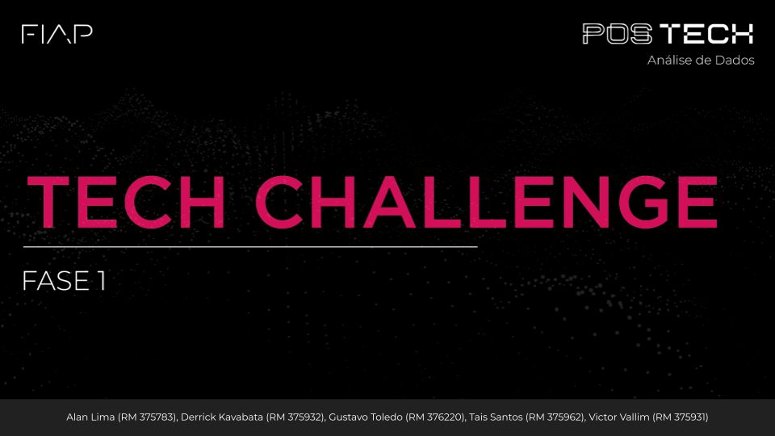

  

  Clique na capa para visualizar a apresentação completa

 

  

  <strong>🎥 Apresentação Executiva — Tech Challenge Olist</strong> 
  Clique para assistir ao vídeo completo

# :rocket: Tech Challenge — Fase 1

## :bar_chart: Olist E-commerce | Data Analytics & Business Intelligence

> **Transformando dados transacionais em insights para crescimento, eficiência operacional e geração de valor.**

---

## :compass: Sobre o projeto

Este projeto foi desenvolvido como parte do **Tech Challenge — Fase 1**, com o objetivo de analisar o **Brazilian E-Commerce Public Dataset by Olist** e transformar dados transacionais em uma visão executiva sobre o desempenho do negócio.

A análise foi estruturada a partir da seguinte pergunta norteadora:

> **Quais são os caminhos mais promissores para gerar valor no futuro?**

A partir dela, investigamos quatro dimensões principais do negócio:

* **Crescimento e Receita**
* **Logística e SLA**
* **Comportamento e Pagamentos**
* **Satisfação do Cliente**

Os resultados foram utilizados para identificar **oportunidades comerciais, gargalos operacionais e pontos de atenção na experiência do cliente**, culminando em recomendações acionáveis.

---

## :dart: Objetivos

O projeto teve como principais objetivos:

* Avaliar a evolução de **pedidos, receita e ticket médio**;
* Identificar **categorias e regiões protagonistas** em vendas;
* Encontrar categorias com **alto potencial comercial**;
* Mapear **gargalos logísticos e rotas críticas**;
* Avaliar a relação entre **atrasos e satisfação do cliente**;
* Analisar **meios de pagamento e comportamento de parcelamento**;
* Investigar **recorrência e retenção de clientes**;
* Identificar categorias que devem ser **investidas, exploradas ou remediadas**;
* Transformar os principais achados em **recomendações estratégicas**.

---

## :card_file_box: Dataset

A análise utiliza o **Brazilian E-Commerce Public Dataset by Olist**, composto por aproximadamente **100 mil pedidos realizados entre 2016 e 2018**.

A base reúne informações de diferentes dimensões da operação:

* Clientes
* Pedidos
* Itens dos pedidos
* Produtos
* Vendedores
* Pagamentos
* Avaliações
* Geolocalização

Os dados são públicos, reais e anonimizados.

**Fonte do dataset:**

### [Dataset Olist](https://www.kaggle.com/datasets/olistbr/brazilian-ecommerce)
---

## :microscope: Metodologia

Foi utilizado o processo de **Knowledge Discovery in Databases (KDD)** para estruturar o desenvolvimento da análise:

**Seleção → Limpeza → Transformação → Análise → Interpretação**

### :broom: Preparação dos dados

A etapa de preparação contemplou:

* Tratamento de registros incompletos e divergentes;
* Padronização de campos e datas;
* Tratamento e transformação de informações de localização;
* Criação de indicadores relacionados à operação logística;
* Integração das diferentes tabelas do dataset;
* Tratamento de valores atípicos nas variáveis analisadas.

### :chart_with_upwards_trend: Indicadores

Foram definidos KPIs para acompanhar diferentes dimensões do negócio, permitindo transformar os dados em informações comparáveis e úteis para a tomada de decisão.

---

# :mag: Análises

## :moneybag: 1. Crescimento e Receita

A análise comercial buscou entender como **volume de pedidos e ticket médio** contribuem para a geração de receita.

Foram investigados:

* Evolução temporal de pedidos e receita;
* Ticket médio;
* Participação regional;
* Desempenho por categoria;
* Relação entre volume, ticket e faturamento.

### :bulb: Principais insights

* **2017 marcou uma forte aceleração da operação**, com crescimento de pedidos e receita;
* A evolução da receita foi puxada principalmente por **volume de pedidos**;
* **São Paulo concentra aproximadamente 42% dos pedidos**, evidenciando forte concentração regional;
* Categorias de alto volume nem sempre apresentam alto ticket;
* Algumas categorias apresentam **ticket elevado, mas baixa penetração**, indicando potencial comercial.

---

## :truck: 2. Logística e SLA

A análise logística teve como objetivo identificar onde estão concentrados os principais gargalos da jornada de entrega.

Foram avaliados:

* Tempo entre as diferentes etapas da jornada;
* Lead time;
* Taxa de atraso;
* Frete em relação ao valor do produto;
* Desempenho por região;
* Rotas críticas.

### :bulb: Principais insights

* A etapa entre **postagem e entrega** concentra a maior parcela do tempo da jornada;
* O ciclo logístico completo chega a aproximadamente **12,6 dias**;
* Estados da região Norte apresentam alguns dos maiores lead times;
* Em determinadas combinações, o **frete supera o próprio valor do produto**;
* Rotas originadas em São Paulo concentram parte relevante da exposição operacional;
* Rotas críticas combinam **alto lead time, maior atraso e volume relevante de pedidos**.

---

## :credit_card: 3. Comportamento e Pagamentos

Esta frente buscou compreender como os clientes realizam suas compras e qual o potencial de geração de valor por meio da recorrência.

Foram analisados:

* Meios de pagamento;
* Número de parcelas;
* Valor médio por faixa de parcelamento;
* Frequência de compra;
* Recompra;
* Retenção por coorte;
* Valor acumulado por perfil de cliente.

### :bulb: Principais insights

* O **cartão de crédito representa aproximadamente 74% dos pagamentos**;
* Compras com maior número de parcelas apresentam, em média, maior valor;
* Apenas **3,1% dos clientes realizaram uma nova compra** no período analisado;
* A retenção apresenta forte queda após a primeira compra;
* Clientes recorrentes acumulam aproximadamente **R$ 315**, contra **R$ 162** entre clientes de compra única;
* A baixa recorrência representa uma **importante oportunidade de geração de valor sobre a base existente**.

---

## :star: 4. Satisfação do Cliente

A análise de satisfação buscou identificar categorias e situações que apresentam maior risco para a experiência do cliente.

Foram considerados:

* Review score;
* Quantidade de avaliações;
* Faturamento;
* Ticket médio;
* Volume de pedidos;
* Taxa de atraso;
* Relação entre atraso e satisfação.

### :bulb: Principais insights

* As avaliações apresentam concentração relevante nas notas extremas;
* Categorias com **maior volume de avaliações e menor score** representam prioridades de remediação;
* A partir de aproximadamente **3 dias de atraso**, observa-se uma queda acentuada na avaliação média;
* O atraso aparece como um importante ponto de atenção para a experiência do cliente;
* Categorias de alto peso comercial e menor satisfação devem receber maior prioridade.

---

# :rocket: Oportunidades e Recomendações

Com base nos diagnósticos realizados, foram identificadas as seguintes frentes estratégicas:

### 01. Capturar potencial de categorias de alto ticket

Categorias com **ticket acima da média e baixo volume** apresentam oportunidade para aumento de penetração e contribuição para a receita.

**Ação recomendada:** campanhas comerciais direcionadas e estratégias específicas para ampliar o volume dessas categorias.

---

### 02. Escalar categorias de alto volume

Categorias com alto volume e ticket mais baixo apresentam espaço para aumentar o valor médio da cesta.

**Ação recomendada:** utilização de **cross-sell, kits e incentivos de cesta**.

---

### 03. Aumentar recorrência

Apenas **3,1% dos clientes retornam para uma nova compra**, enquanto clientes recorrentes apresentam aproximadamente o dobro do valor acumulado.

**Ação recomendada:** desenvolver estratégias de retenção e estímulo à segunda compra.

---

### 04. Remediar satisfação em categorias prioritárias

Categorias de alto impacto comercial com **menor satisfação e maior exposição a atrasos** devem ser priorizadas.

**Ação recomendada:** reduzir atrasos e acompanhar conjuntamente indicadores de experiência e desempenho comercial.

---

### 05. Otimizar rotas críticas

Algumas rotas concentram simultaneamente **alto custo, maior tempo de entrega e maior exposição a atrasos**.

**Ação recomendada:** revisão de SLAs, avaliação de parceiros logísticos e monitoramento contínuo das rotas críticas.

---

### 06. Facilitar compras de maior valor

O comportamento de parcelamento indica associação entre **maior número de parcelas e maior valor médio das compras**.

**Ação recomendada:** dar maior visibilidade às condições de parcelamento em produtos de maior ticket e acompanhar seu impacto sobre conversão e ticket médio.

---

# :checkered_flag: Conclusão

A análise aponta três caminhos prioritários para geração de valor:

### **Aumentar recorrência**

Apenas **3,1% dos clientes retornam**, enquanto clientes recorrentes apresentam maior valor acumulado.

### **Corrigir gargalos logísticos**

Rotas críticas combinam **alto lead time, atraso e custo de frete**, criando oportunidades de eficiência operacional.

### **Capturar potencial comercial**

Categorias de **alto ticket e baixo volume** apresentam espaço para crescimento, enquanto categorias de alto impacto comercial e menor satisfação devem ser priorizadas para remediação.

> **A oportunidade não está apenas em vender mais, mas em vender melhor, reter mais clientes e reduzir os pontos de fricção da jornada.**

---

# :bar_chart: Dashboard

Foi desenvolvido um dashboard em **Power BI** para consolidar os principais indicadores e permitir a exploração dos resultados por diferentes dimensões.

O painel permite analisar e filtrar informações relacionadas a:

* KPIs comerciais;
* Categorias;
* Regiões;
* Logística;
* Satisfação;
* Pedidos;
* Ocorrências.

**Dashboard:**
[Dashboard de Satisfação](https://app.powerbi.com/view?r=eyJrIjoiYzUzYTM1MWMtMjM2NS00YjYyLWI0MzgtMzczNGZmMTdkZDQyIiwidCI6IjY5MWEzZDExLWU1YzctNDQ5ZC04Y2M5LWUwOTYyNjVhNGI2MiJ9)

---

# :toolbox: Tecnologias utilizadas

### :snake: Python

* Pandas
* NumPy
* Matplotlib
* Seaborn
* Plotly

### :bar_chart: Business Intelligence

* Power BI

### :computer: Ambiente

* Google Colab

### :books: Versionamento e documentação

* GitHub

# :package: Entregáveis

### 📊 Apresentação Executiva

[Arquivo Apresentação](https://github.com/gtoledodata/case-olist-data-analysis/blob/325f77add8566bf8827ab8ab36e53ae6725b2c50/apresentacao/Apresentac%CC%A7a%CC%83o.pdf)

### 🎥 Vídeo Executivo

▶️ [Assistir à apresentação executiva no YouTube](https://www.youtube.com/watch?v=OgneuRdHVIE)

### 💻 Repositório

Este repositório contém os códigos, análises e materiais utilizados no desenvolvimento do projeto.

---

# :busts_in_silhouette: Equipe

**Alan Lima** (RM 375783)  
**Derrick Kavabata** (RM 375932)  
**Gustavo Toledo** (RM 376220)  
**Tais Santos** (RM 375962)  
**Victor Vallim** (RM 375931)  

---

## Tech Challenge — Fase 1

**Data Analytics & Artificial Intelligence**

Projeto desenvolvido para aplicação prática dos conhecimentos adquiridos ao longo da fase, utilizando dados reais para apoiar **análise, diagnóstico e tomada de decisão**.
